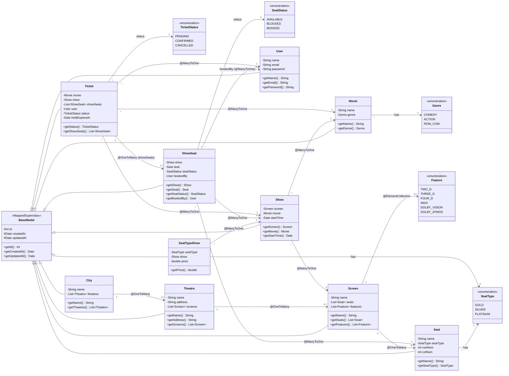
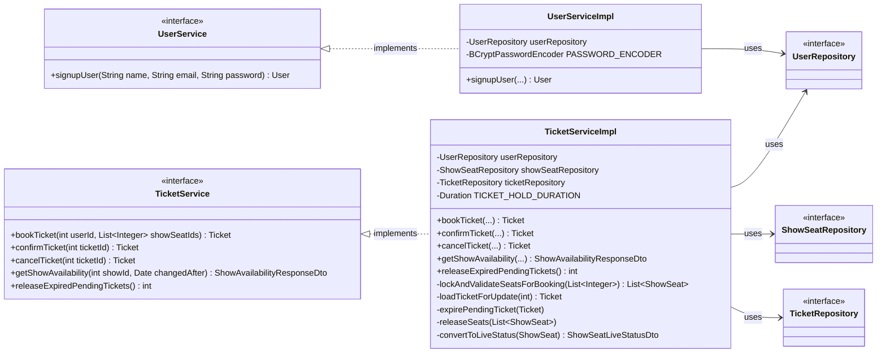
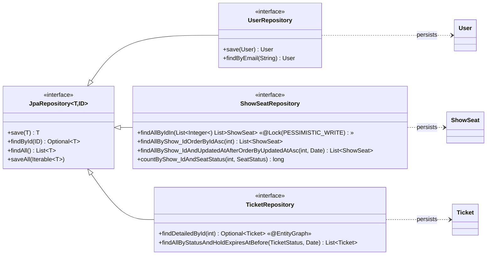
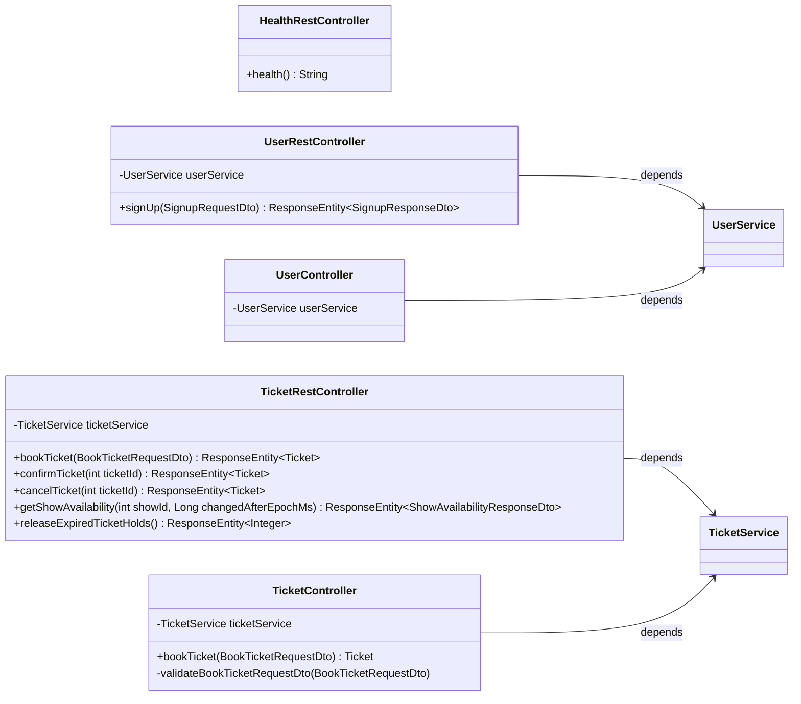
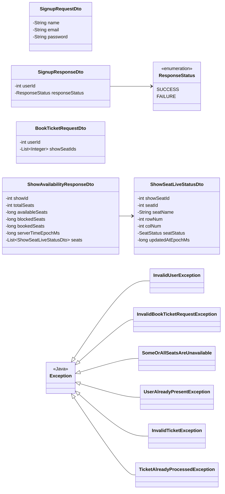
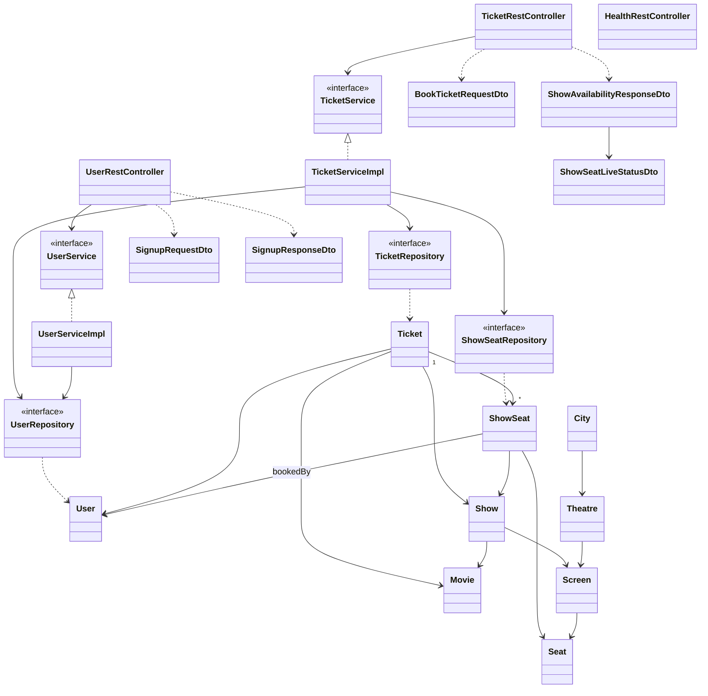
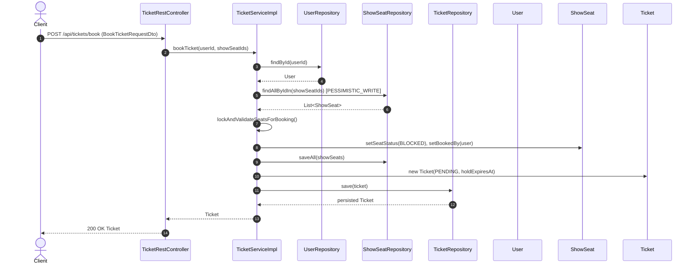
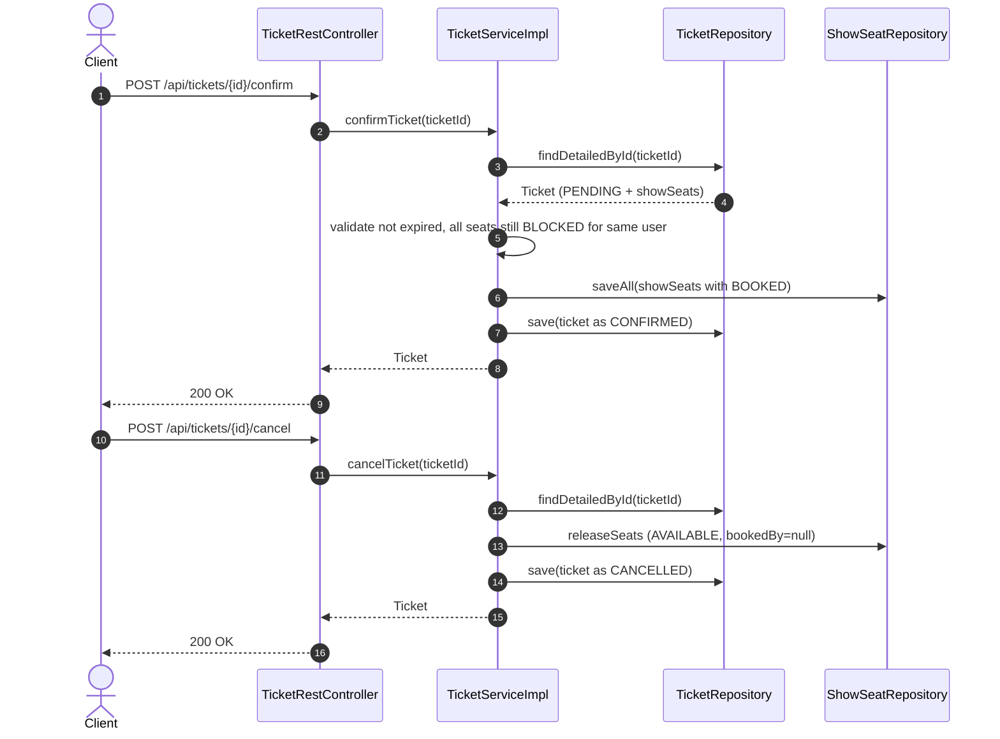

# BookMyShow - UML Class Diagram (Full)

This document presents the complete class diagram of the `BMSDec24` system, organized into multiple views (Domain, Service, Controller, Repository, DTO, Exception). All diagrams use Mermaid and accurately reflect the current codebase.

---

## 1) Domain / Entity Model (with JPA relationships)

Shows business entities, inheritance, multiplicities, and FK-style associations.

---

## 2) Service Layer (Business Logic)

Shows service interfaces, implementations, and which repositories/models they coordinate.

---

## 3) Repository Layer (Spring Data JPA)

Shows repositories with their domain entities and key custom finders.

---

## 4) Controller Layer (REST API)

Shows REST controllers, the services they depend on, and the DTOs/exceptions used.

---

## 5) DTOs and Exceptions

Shows request/response payloads and the exception hierarchy thrown across layers.

---

## 6) End-to-End Architecture (Layered View)

A single picture showing the layered interaction across all classes.

---

## 7) Booking Flow - Class Interaction Sequence

How the classes collaborate during the `bookTicket` flow.

---

## 8) Confirm / Cancel Flow

---

## 9) Cardinality / Mapping Reference

A quick textual mapping reference of all multiplicities used in the entity model.

| Source         | Target         | Multiplicity | JPA Annotation     | Field         |
|----------------|----------------|--------------|--------------------|---------------|
| `City`         | `Theatre`      | 1 → 0..*     | `@OneToMany`       | `theatres`    |
| `Theatre`      | `Screen`       | 1 → 0..*     | `@OneToMany`       | `screens`     |
| `Screen`       | `Seat`         | 1 → 0..*     | `@OneToMany`       | `seats`       |
| `Screen`       | `Feature`      | 1 → 0..*     | `@ElementCollection` | `features`  |
| `Show`         | `Screen`       | * → 1        | `@ManyToOne`       | `screen`      |
| `Show`         | `Movie`        | * → 1        | `@ManyToOne`       | `movie`       |
| `ShowSeat`     | `Show`         | * → 1        | `@ManyToOne`       | `show`        |
| `ShowSeat`     | `Seat`         | * → 1        | `@ManyToOne`       | `seat`        |
| `ShowSeat`     | `User`         | * → 0..1     | `@ManyToOne`       | `bookedBy`    |
| `SeatTypeShow` | `Show`         | * → 1        | `@ManyToOne`       | `show`        |
| `Ticket`       | `User`         | * → 1        | `@ManyToOne`       | `user`        |
| `Ticket`       | `Show`         | * → 1        | `@ManyToOne`       | `show`        |
| `Ticket`       | `Movie`        | * → 1        | `@ManyToOne`       | `movie`       |
| `Ticket`       | `ShowSeat`     | 1 → 1..*     | `@OneToMany`       | `showSeats`   |

---

## 10) Suggested Rendering

- All Mermaid blocks render natively in GitHub, VS Code (Markdown preview), and most modern Markdown viewers.
- For slide decks, export each diagram via [Mermaid Live Editor](https://mermaid.live) as SVG/PNG.
